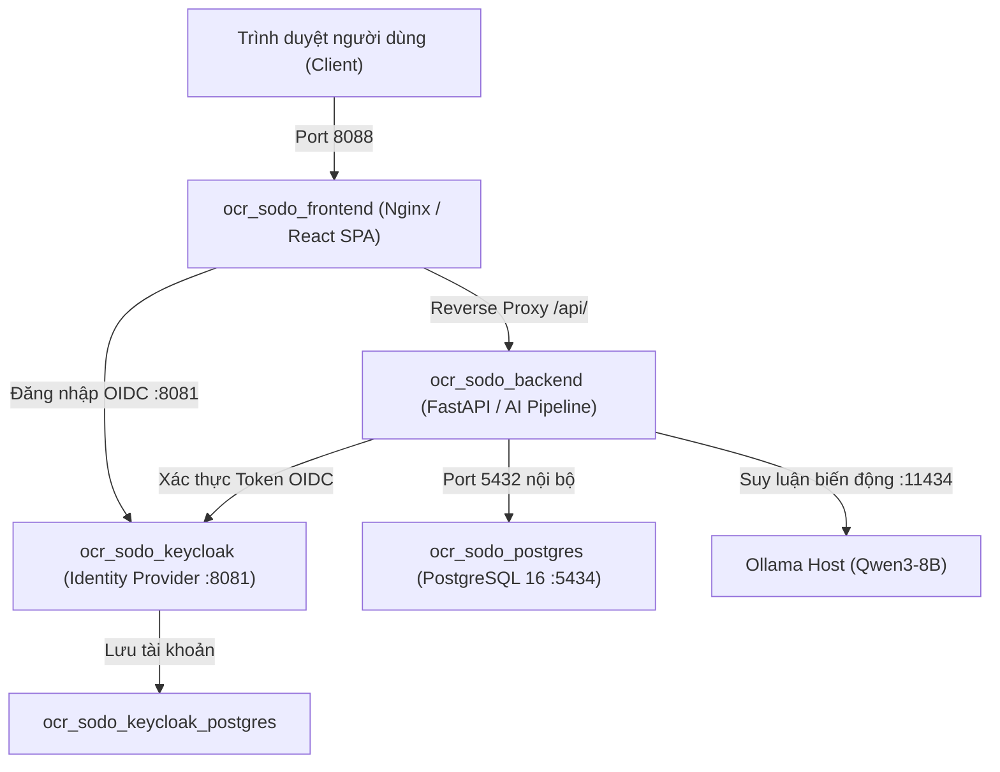

# HƯỚNG DẪN TRIỂN KHAI VÀ VẬN HÀNH HỆ THỐNG BẰNG DOCKER

> **Tài liệu hướng dẫn chi tiết từ A-Z cách thiết lập môi trường, cấu hình file `.env`, khởi chạy, bảo trì, sao lưu cơ sở dữ liệu và xử lý sự cố khi chạy toàn bộ hệ thống OCR Sổ Đỏ bằng Docker.**

---

## 🏗️ 1. Kiến Trúc Các Container Trong Docker Stack

Hệ thống được thiết kế theo kiến trúc Microservices độc lập, khởi chạy đồng bộ thông qua `docker-compose.yml`:



### Bảng phân bổ cổng kết nối (Port Mapping):

| Container | Image | Cổng Container | Cổng Host (Mặc định) | Mục Đích |
| :--- | :--- | :---: | :---: | :--- |
| **`ocr_sodo_frontend`** | Nginx Alpine (React Build) | `80` | **`8088`** | Giao diện Web SPA cho người dùng |
| **`ocr_sodo_backend`** | Python 3.12 (PyTorch + Paddle) | `8000` | **`8008`** | API REST & Pipeline OCR, Swagger UI |
| **`ocr_sodo_postgres`** | Postgres 16 Alpine | `5432` | **`5434`** | CSDL lưu trữ hồ sơ, dữ liệu 129 cột *(không trùng cổng 5432 máy chủ)* |
| **`ocr_sodo_keycloak`** | Keycloak 26.6.4 | `8080` | **`8081`** | Máy chủ đăng nhập, xác thực tập trung SSO |
| **`ocr_sodo_keycloak_postgres`** | Postgres 16 Alpine | `5432` | *Nội bộ* | CSDL lưu tài khoản, phân quyền Keycloak |

---

## ⚙️ 2. Yêu Cầu Môi Trường Cần Chuẩn Bị

### 2.1. Yêu cầu phần mềm
1. **Docker Engine & Docker Compose:**
   - **Windows:** Cài đặt [Docker Desktop for Windows](https://www.docker.com/products/docker-desktop/) (bật chế độ WSL2 Backend).
   - **Linux:** Cài đặt `docker-ce` và `docker-compose-plugin` (phiên bản Compose v2).
2. **Hỗ trợ GPU NVIDIA (Khuyến nghị để OCR nhanh gấp 5-10 lần):**
   - Đã cài NVIDIA Driver mới nhất trên máy host.
   - **Windows:** Docker Desktop tự động chia sẻ GPU thông qua WSL2.
   - **Linux:** Cài đặt thêm `nvidia-container-toolkit` để container nhận GPU:
     ```bash
     sudo apt-get install -y nvidia-container-toolkit
     sudo systemctl restart docker
     ```

---

## 📝 3. Cấu Hình File Môi Trường (`.env`)

Tại thư mục gốc của dự án (`ocr-so-do`), kiểm tra và tạo file `.env` từ file mẫu `.env.example`:

```powershell
# Copy file mẫu nếu chưa có .env
Copy-Item .env.example .env
```

### Các thông số cốt lõi cần lưu ý trong `.env`:

```ini
# ── Mật khẩu Cơ sở dữ liệu PostgreSQL (Bắt buộc đặt) ──
PG_USER=postgres
PG_PASSWORD=MatKhauDatabaseManh123@
PG_DATABASE=ocr_so_do

# ── Mật khẩu & Tài khoản Keycloak SSO ──
KEYCLOAK_DB_USER=keycloak
KEYCLOAK_DB_PASSWORD=KeycloakDbPass123@
KEYCLOAK_DB_DATABASE=keycloak

KEYCLOAK_BOOTSTRAP_ADMIN_USERNAME=kc-bootstrap-admin
KEYCLOAK_BOOTSTRAP_ADMIN_PASSWORD=BootstrapAdminPass123@

OCR_INITIAL_ADMIN_USERNAME=admin
OCR_INITIAL_ADMIN_PASSWORD=OcrAdminPass123@
OCR_KEYCLOAK_ADMIN_CLIENT_SECRET=SecretClientChuanOcr123@

# ── Địa chỉ truy cập Public của Keycloak (Host Port 8081) ──
OCR_KEYCLOAK_PUBLIC_URL=http://127.0.0.1:8081

# ── Đường dẫn thư mục chứa Hồ sơ gốc quét PDF/Ảnh trên máy chủ ──
# (Ví dụ: Thư mục chứa các tệp PDF sổ đỏ cần quét hàng loạt)
OCR_HSQ_VILG_SOURCE_PATH=D:\Tho\OCR\DataOCR

# ── Kết nối Ollama suy luận biến động Trang 4 ──
OLLAMA_URL=http://host.docker.internal:11434
LLM_MODEL_NAME=qwen3:8b
```

> ⚠️ **LƯU Ý QUAN TRỌNG:**
> Biến `OCR_HSQ_VILG_SOURCE_PATH` phải trỏ đúng đến một thư mục có thật trên máy của bạn. Docker sẽ mount thư mục này vào trong backend tại đường dẫn `/data/hsq-vilg` để bảo đảm an toàn dữ liệu.

---

## 🚀 4. Hướng Dẫn Khởi Chạy Hệ Thống

### 4.1. Khởi chạy toàn bộ hệ thống lần đầu tiên (Build & Run)

Mở PowerShell tại thư mục `d:\Tho\OCR\OCR_V3\ocr-so-do` và chạy:

```powershell
docker compose up -d --build
```

Lệnh này sẽ tự động:
1. Tải các base image chính thức (`postgres:16-alpine`, `quay.io/keycloak/keycloak`).
2. Build image `backend` (Cài đặt PyTorch, PaddleOCR, dependencies, copy code và cấu hình).
3. Build image `frontend` (Build mã nguồn React/TypeScript qua Vite và đóng gói vào Nginx).
4. Khởi động 5 container theo thứ tự phụ thuộc (Database & Keycloak khởi động trước -> Backend -> Frontend).

### 4.2. Kiểm tra trạng thái hoạt động của các container

```powershell
docker compose ps
```

Nếu tất cả các container đều ở trạng thái `Up` (hoặc `healthy`), hệ thống đã hoạt động bình thường:
```
NAME                          STATUS                  PORTS
ocr_sodo_frontend             Up                      127.0.0.1:8088->80/tcp
ocr_sodo_backend              Up                      127.0.0.1:8008->8000/tcp
ocr_sodo_keycloak             Up (healthy)            127.0.0.1:8081->8080/tcp
ocr_sodo_postgres             Up (healthy)            127.0.0.1:5434->5432/tcp
ocr_sodo_keycloak_postgres    Up (healthy)            5432/tcp
```

### 4.3. Theo dõi nhật ký (Logs) khi vận hành

```powershell
# Xem log toàn bộ hệ thống
docker compose logs -f

# Xem riêng log của Backend (xử lý OCR và trích xuất dữ liệu)
docker compose logs -f backend

# Xem riêng log của Keycloak
docker compose logs -f keycloak
```

---

## 🌐 5. Truy Cập Hệ Thống Sau Khi Chạy

| Dịch vụ | Đường dẫn truy cập trên trình duyệt | Tài khoản / Ghi chú |
| :--- | :--- | :--- |
| **Giao diện Web SPA** | **[http://127.0.0.1:8088](http://127.0.0.1:8088)** | Đăng nhập tài khoản cán bộ được cấp |
| **Swagger API Docs** | **[http://127.0.0.1:8008/docs](http://127.0.0.1:8008/docs)** | Xem và thử nghiệm trực tiếp các REST API |
| **Trang Quản Trị Keycloak** | **[http://127.0.0.1:8081](http://127.0.0.1:8081)** | User: `kc-bootstrap-admin` / Mật khẩu trong `.env` |
| **Cơ sở dữ liệu PostgreSQL** | `Host: 127.0.0.1`, `Port: 5434` | Dùng DBeaver / pgAdmin để kết nối trực tiếp |

---

## 🔄 6. Cách Cập Nhật Khi Có Thay Đổi Code (Hot Update)

Khi bạn sửa đổi code backend (ví dụ: tối ưu hàm bóc tách `cadastral_129_mapper.py`, `validators.py`):

```powershell
# 1. Build lại image backend chứa code mới nhất
docker compose build backend

# 2. Khởi động lại container backend (không ảnh hưởng DB và Keycloak)
docker compose up -d backend
```

> 💡 **Ưu điểm:** Cơ sở dữ liệu hồ sơ trong PostgreSQL và các phiên đăng nhập Keycloak hoàn toàn không bị gián đoạn hay mất dữ liệu!

---

## 💾 7. Sao Lưu (Backup) & Khôi Phục (Restore) Dữ Liệu

Toàn bộ dữ liệu hồ sơ đã quét được lưu bền vững trong Docker volume `ocr_sodo_pgdata`.

### 7.1. Sao lưu dữ liệu ra file `.sql`:
```powershell
docker exec -t ocr_sodo_postgres pg_dump -U postgres -d ocr_so_do > backup_ocr_sodo.sql
```

### 7.2. Khôi phục dữ liệu từ file `.sql`:
```powershell
docker exec -i ocr_sodo_postgres psql -U postgres -d ocr_so_do < backup_ocr_sodo.sql
```

---

## 🛑 8. Dừng Và Khởi Động Lại Hệ Thống

```powershell
# Tạm dừng toàn bộ hệ thống (dữ liệu vẫn an toàn nguyên vẹn trong volumes):
docker compose down

# Dừng và xóa toàn bộ volumes (⚠️ CẢNH BÁO: Lệnh này sẽ XÓA SẠCH CSDL):
# docker compose down -v  <-- KHÔNG DÙNG NẾU KHÔNG CẦN RESET TỪ ĐẦU!
```

---

## 🛠️ 9. Khắc Phục Sự Cố Thường Gặp (Troubleshooting)

### 1. Lỗi cổng bị chiếm dụng (Port already allocated)
- **Triệu chứng:** `Bind for 0.0.0.0:5434 failed: port is already allocated` hoặc `8088`.
- **Cách khắc phục:** Mở file `docker-compose.yml` và đổi cổng host bên trái dấu `:`, ví dụ đổi `8088:80` thành `8089:80` hoặc tắt ứng dụng đang chiếm cổng đó trên máy tính.

### 2. Lỗi GPU không nhận trong Container Linux
- **Triệu chứng:** `could not select device driver "" with capabilities: [[gpu]]`.
- **Cách khắc phục:** Máy chưa cài `nvidia-container-toolkit`. Chạy lệnh sau để cài đặt và restart Docker:
  ```bash
  sudo apt-get install -y nvidia-container-toolkit && sudo systemctl restart docker
  ```
- Hoặc nếu muốn chạy tạm bằng CPU, bạn có thể comment tạm khối `reservations: devices` của service `backend` trong `docker-compose.yml`.

### 3. Lỗi không tìm thấy thư mục nguồn `OCR_HSQ_VILG_SOURCE_PATH`
- **Triệu chứng:** Docker compose báo lỗi biến môi trường hoặc backend không thấy thư mục quét.
- **Cách khắc phục:** Đảm bảo đường dẫn trong `.env` tồn tại trên máy tính thực tế.
